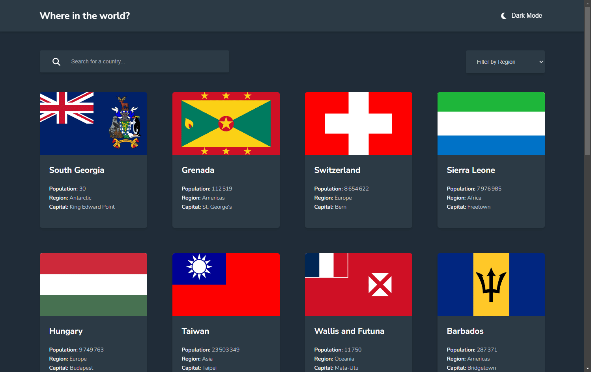

# Frontend Mentor - REST Countries API with color theme switcher solution

## Table of contents

- [Overview](#overview)
  - [The challenge](#the-challenge)
  - [Screenshot](#screenshot)
  - [Links](#links)
- [My process](#my-process)
  - [Built with](#built-with)
  - [Useful resources](#useful-resources)
- [Author](#author)

### The challenge

Users should be able to:

- See all countries from the API on the homepage
- Search for a country using an `input` field
- Filter countries by region
- Click on a country to see more detailed information on a separate page
- Click through to the border countries on the detail page
- Toggle the color scheme between light and dark mode _(optional)_

### Screenshot

### Links

- Live Site URL: [Add live site URL here](https://boysers.github.io/frontend-mentor-rest-countries-api-with-color-theme-switcher/)

## My process

### Built with

- [Vite](https://vite.dev/)
- [TypeScript](https://www.typescriptlang.org/)
- [React](https://react.dev/)
- [React Router](https://reactrouter.com/) - library
- [Panda CSS](https://panda-css.com/)

### Useful resources

- [Multi-Theme Tokens - Panda CSS](https://panda-css.com/docs/guides/multiple-themes) - color mode
- [REST Countries](https://restcountries.com/) - api

## Author

- GitHub - [@boysers](https://github.com/boysers)
- Frontend Mentor - [@boysers](https://www.frontendmentor.io/profile/boysers)
